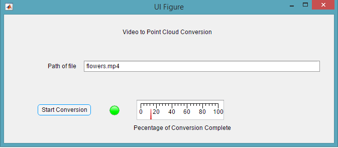
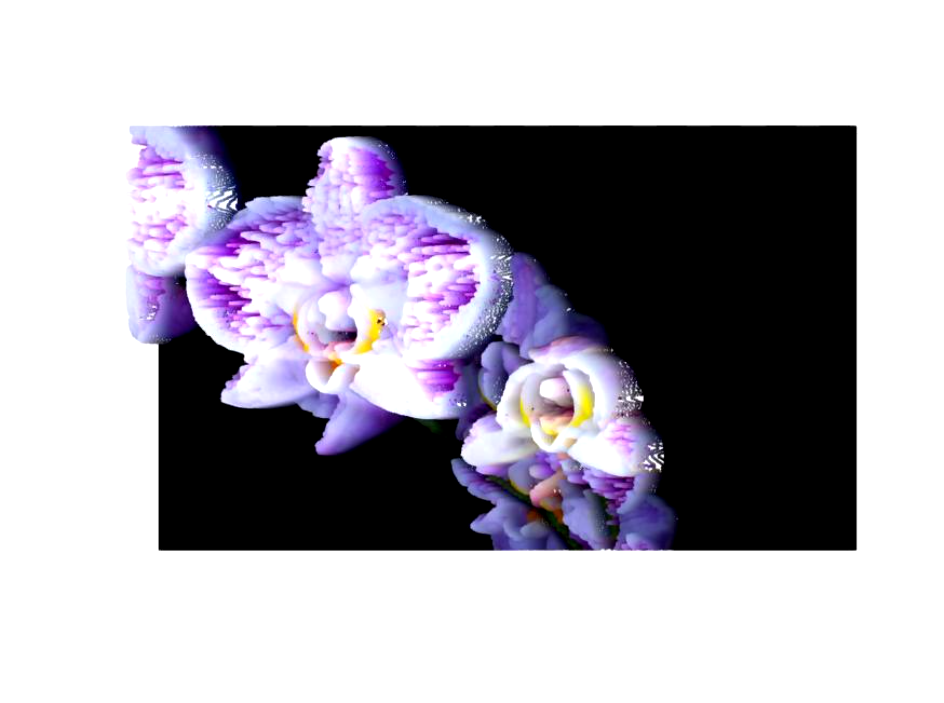

# Video-To-Pointcloud

Converts a video into a 3d point cloud and rotates the view of the camera to see the effect.
More features coming soon....

## Interface

## Original Frame

## Same Frame in Point Cloud

